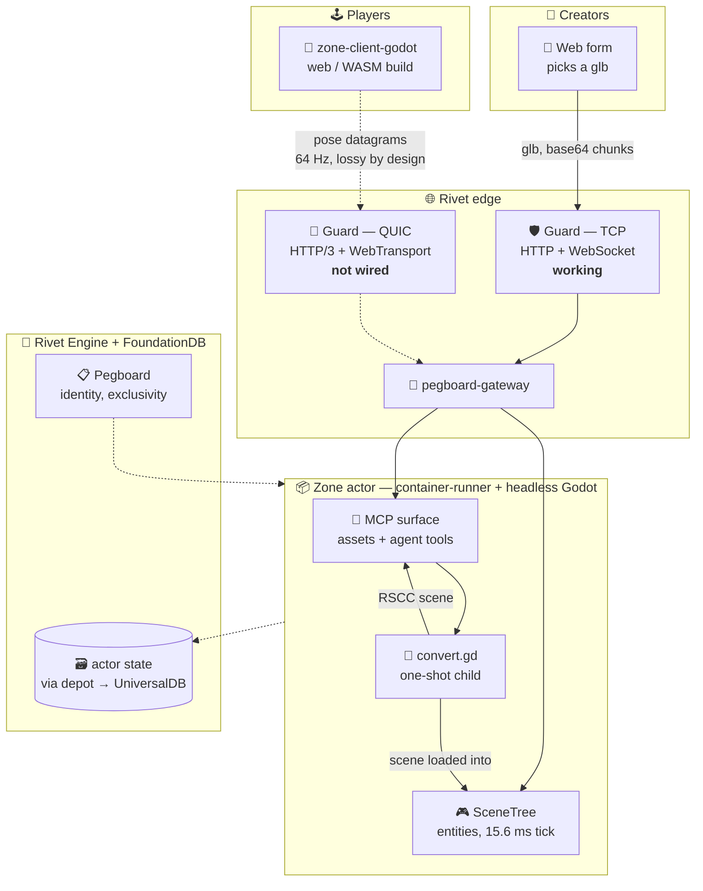
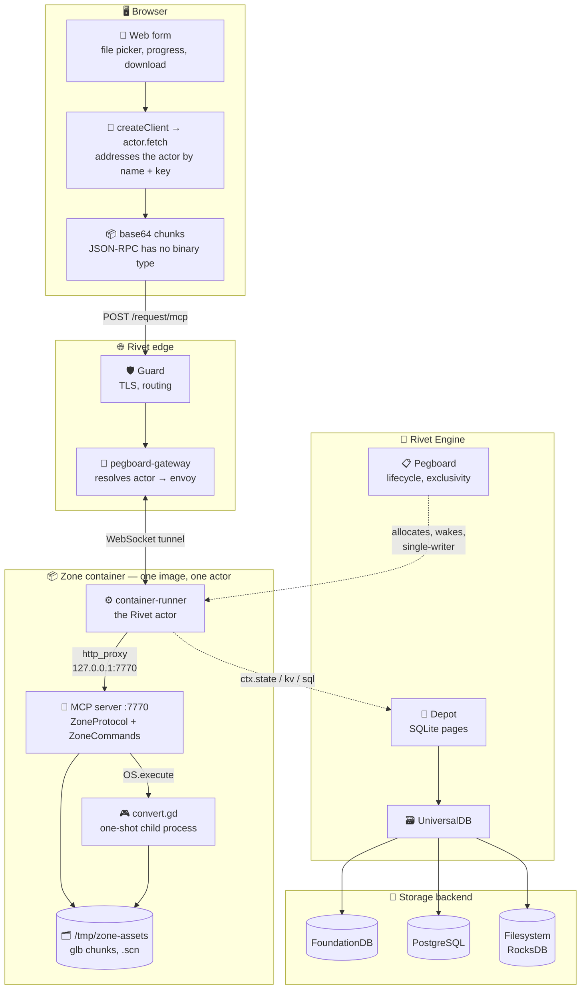
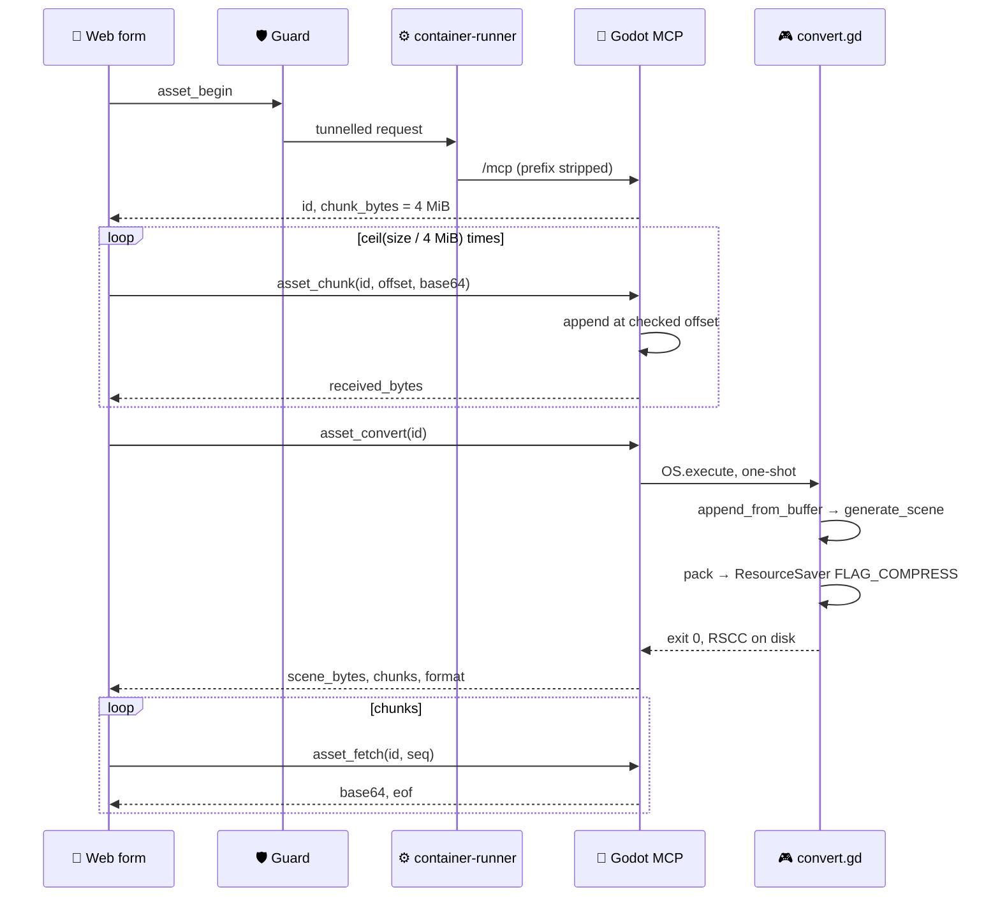

# RFD 0022 — POST a glb, get a Godot scene

## Status

Implemented and measured locally. A 43 MB glb round-trips in 17 seconds and the
zone actor stays under 44 MiB. Not yet run through a live Rivet cluster: the
engine image has never been built ([RFD 0017](0017-engine-bring-up.md)), so the
path below is verified from `container-runner`'s child inward and reasoned about
outward.

## Problem

Convert a 100 MB glTF asset into a Godot scene, from a client, without adding
storage, a transport, or a second container.

**Self-contained glTF only**, which is a property of the file rather than of the
extension. An earlier draft of this RFD said `.gltf` was excluded outright; that
was wrong.

| Input | Works | Why |
|---|---|---|
| `.glb` | **yes** | binary container, self-contained by construction |
| `.gltf` **embedded** — buffers as `data:` URIs | **yes** | self-contained, verified |
| `.gltf` **regular** — references `.bin` or loose textures | **no** | the sibling files are never uploaded |

To be explicit, because the extension is the same in both `.gltf` rows:
**embedded `.gltf` works, regular `.gltf` does not.** Nothing about the filename
distinguishes them, so a user cannot tell by looking, and neither can the form's
`accept` filter.

Verified both ways. A self-contained `.gltf` converts and loads
(`{"event":"loaded","mesh_instances":1}`); one with an external buffer fails
with `glTF: Binary file not found: /external.bin`.

That failure is **loud**, which is what makes accepting `.gltf` safe: a user who
uploads a non-self-contained file gets a clear error naming the missing file,
not a silently empty scene.

vrm is deferred; see [Deferred](#deferred).

100 MB fits nowhere in one piece. Rivet caps an incoming message at 32 MiB and a
request body at 20 MiB, and MCP is JSON-RPC so binary must be base64, which
inflates by a third. The payload has to be chunked whatever else is decided.

## Decision

Chunk it over MCP, using the surface the zone already exposes. No new route, no
new container, no external storage.

Five tools are added by subclassing the addon rather than patching it, since it
is pinned by commit:

| Tool | Does |
|---|---|
| `asset_begin` | mint an id, return the chunk size |
| `asset_chunk` | append one base64 chunk at a checked offset |
| `asset_status` | bytes received so far, for resuming |
| `asset_convert` | glb to compressed scene, in a child process |
| `asset_fetch` | return one base64 chunk of the result |

## Where this sits in the fabric

Asset conversion is one path through the V-Sekai fabric, not a standalone
service. The same zone actor that converts a glb also serves players, and the
two reach it over different transports.



Solid edges are paths that work today. **Dotted edges through `Guard — QUIC` do
not exist yet**, and they are blocked in two places rather than one: the QUIC
listener is built but never bound, and the tunnel behind it has no datagram
frame. See [RFD 0007](0007-webtransport-in-guard.md).

### What a WebTransport demo has to prove

A demo that runs MCP over a WebTransport stream proves nothing. A WebTransport
bidirectional stream is reliable and ordered, exactly like a WebSocket, so
moving the asset path onto one is a port rather than a demonstration. The bar is
higher: **the demo must be something WebSocket cannot do at all.**

Two candidates, and only one survives the test.

**Independent streams. Rejected.** The obvious pitch is uploading a 100 MB glb
on one stream while control messages flow on another, with no head-of-line
blocking between them. But a client can open two WebSockets, get two TCP
connections, and obtain the same isolation. WebTransport is cheaper here, one
handshake and one congestion controller instead of two, and cheaper is not
impossible. This fails the bar.

**Unreliable datagrams. The real answer.** WebSocket has no unreliable mode.
None. There is no flag, no option, no workaround, because it is defined over a
reliable ordered byte stream.

That gap is the entire social VR problem. At a 15.6 ms tick a pose that arrives
late is not merely useless, it is worse than nothing, because the next tick has
already superseded it. TCP cannot know that. It retransmits the stale pose,
and it holds every fresher pose behind it until the retransmission lands. Loss
becomes latency for the whole stream, and the avatar visibly stalls rather than
degrades.

Datagrams invert it. A lost pose is simply gone, the next one is already on the
way, and nothing behind it waits. **Discarding late data is the feature**, and it
is the one thing only WebTransport offers.

### The demo

Avatars in a zone, poses at 64 Hz as WebTransport datagrams, authoritative
state broadcast back the same way. Run the identical scenario over WebSocket.
Impair the link with `tc netem` at 2% loss and 50 ms RTT, which is an ordinary
mobile network rather than a pathological one.

Measure p95 and p99 of pose-to-render latency against the 15.6 ms tick.

The expected result is that WebSocket p99 climbs to multiples of RTT under loss
while WebTransport stays flat and simply drops poses. If both stay flat, the
demo has disproved its own premise and is still worth having, because
`rfd/0023` chose the transport on this reasoning.

Asset conversion stays on TCP, where a 100 MB upload genuinely wants
reliability and ordering. It is what puts content in the zone, not the thing
being demonstrated.

### What blocks it

QUIC is not the blocker. `h3_server.rs` already calls `.enable_datagram(true)`,
and `WebTransportSession` exposes `datagram_reader` and `datagram_sender`.

The tunnel is. `pegboard-gateway` carries traffic over `universalpubsub` in a
WebSocket shape in both directions, `tunnel_to_ws_task.rs` and
`ws_to_tunnel_task.rs`, and contains no datagram concept at all. A datagram
arriving at Guard has nowhere to go.

So the work is, in order:

1. Steps 5 and 6 below. Nothing reaches an actor over QUIC until the listener is
   bound and routed, whatever the payload.
2. A datagram frame in the tunnel, and a lossy path for it. This is the
   substantial piece and the one `h3_server.rs` calls "a separate change".
   Reliable delivery over `universalpubsub` would defeat the purpose, so the
   tunnel has to be allowed to drop.
3. Zone-side send and receive, and a Godot client using `WebTransportPeer`
   datagrams.
4. The measurement above.

Step 2 is where the honesty is. It is not a port of existing plumbing, it is a
new delivery mode through a broker that currently guarantees the opposite.

### What is actually built, verified against the code

| Step | State | Evidence |
|---|---|---|
| Transport erased in `WebSocketHandle` | **done** | `websocket_handle.rs` uses `BoxedWsStream` |
| `quinn`, `h3`, `h3-webtransport` in the workspace | **done** | root `Cargo.toml` |
| QUIC endpoint with ALPN `h3` | **done** | `guard-core/src/h3_server.rs` |
| WebSocket framing over a bidi stream | **done** | `BidiStream` is already `AsyncRead`/`AsyncWrite` |
| Route into `ProxyService` | **not done** | `grep serve_custom_websocket` → 0 hits |
| Bind the listener in `run_server` | **not done** | `run_h3_listener` → 0 call sites |

The transport plumbing compiles and is unreachable. Nothing calls it.

## The cluster, end to end

The asset path in detail. Every hop below is on the TCP side, which is why this
path works today.




Solid edges carry the payload. Dotted edges are control and state, which the
conversion does not use: the bytes never enter actor storage, because the file
is transient and the zone is the only reader.

## The request path



## The client is a web form

`container-runner/examples/godot-demo/web`, following
`examples/raw-fetch-handler`: a Vite and React page with a file picker, a
progress bar, and a download link.

It uses the sample's client pattern rather than hand-built requests:

```ts
const client = createClient(ENGINE);
const actor = client[ACTOR_NAME].getOrCreate([zoneKey]);
await actor.fetch("/mcp", { method: "POST", body: … });
```

so the page never constructs a URL or sets `x-rivet-actor` itself.

### Why the form does not simply POST the file

A plain `multipart/form-data` submit is the normal way a web form uploads, and
it would avoid base64 entirely. It is not available here for two reasons, one
hard and one chosen:

- **A 100 MB body exceeds the 20 MiB request limit**, so a single form POST
  cannot carry the file whatever encoding is used. Chunking is required either
  way.
- **Everything goes through MCP**, which is JSON-RPC, and JSON has no binary
  type. Chunks are therefore base64, costing a third in transfer.

The alternative is raw binary chunks on a second route, keeping MCP for control
only. That saves the 33% and costs a second surface to build and secure. It was
considered and set aside in favour of one surface.

## Why each choice

**4 MiB chunks.** Base64 makes that ~5.33 MiB, comfortably inside the 20 MiB
request body limit. A 100 MB glb is 25 calls, not 400.

**Checked offsets.** `asset_chunk` takes the offset it believes it is writing at
and refuses a mismatch. A duplicate or reordered delivery is rejected instead of
silently corrupting the file, and `asset_status` makes a resume exact rather
than hopeful.

**Conversion in a child process.** A 100 MB import holds the source buffer, the
generated scene, and the packed output at once. In-process, the long-lived actor
would keep that high-water mark for the rest of its life. Measured: the zone
stayed at **43.8 MiB** while converting a 43 MB glb.

**`ResourceSaver.FLAG_COMPRESS`, not hand-rolled zstd.** It writes Godot's own
`RSCC` container, which `ResourceLoader.load` reads directly with no size passed
alongside and no separate decompress step. Compressing the packed bytes by hand
gives roughly 3x better ratio, because RSCC compresses in blocks to stay
seekable, but then the client must carry the uncompressed size out of band,
decompress before loading, and hold both copies. For a 100 MB asset that peak
costs more than the transfer saves.

**Subclassing, not patching.** `zone_commands.gd extends MCPCommands` and
`zone_protocol.gd` extends the addon's protocol, so the five tools appear in
`tools/list` alongside the addon's 65 and the pinned commit stays untouched.

## Measured

Against `godot-zone-mcp` locally, Godot 4.7.1:

| Input | Chunks up | Scene out | Chunks down | Wall | Zone memory |
|---|---|---|---|---|---|
| 35 KB, 200 meshes | 1 | 28 KB `RSCC` | 1 | <1s | — |
| 43 MB, 60 distinct meshes | 11 | 30.9 MB `RSCC` | 8 | 17s | 43.8 MiB |

Both round trips were verified by loading the returned bytes:
`{"event":"loaded","mesh_instances":200,"root":"TestRoot"}`. That check matters
because `generate_scene` does not set node `owner`, and without the `_claim`
walk in `convert.gd` the packed scene is a **single empty root** — a valid file
containing nothing.

## Not verified

- **Never run through a live cluster.** Guard, pegboard-gateway and the tunnel
  are drawn from their code and from an earlier deployment where MCP through the
  gateway did work, not from a run of this path.
- **100 MB itself.** 43 MB is measured; the remainder is extrapolation. Time
  looks linear, memory should stay flat because conversion is a child.
- **The fork's double-precision runtime.** Testing used the upstream Godot in
  `godot-zone-test`. See [RFD 0011](0011-godot-runtime-provenance.md): precision
  is a compile-time property and mixing it desynchronises rather than failing.

## Deferred

**vrm.** A vrm is glTF plus humanoid and spring-bone extensions, so
`GLTFDocument` would read the geometry, but whether the rig and spring bones
survive into the Godot scene depends on the addon set in the runtime and is
untested. Nothing in the pipeline is glb-specific, so adding vrm is a question
about extension fidelity rather than about transport or conversion. It should be
picked up when there is a vrm that needs converting, not before.

## Open questions

- [ ] Should converted output be cached by content hash, so the same glb is not
      converted twice?
- [ ] What cleans up `/tmp/zone-assets` when a conversion is abandoned?
- [ ] Does this belong on the zone at all, or on a dedicated converter actor
      that does not also serve players?
