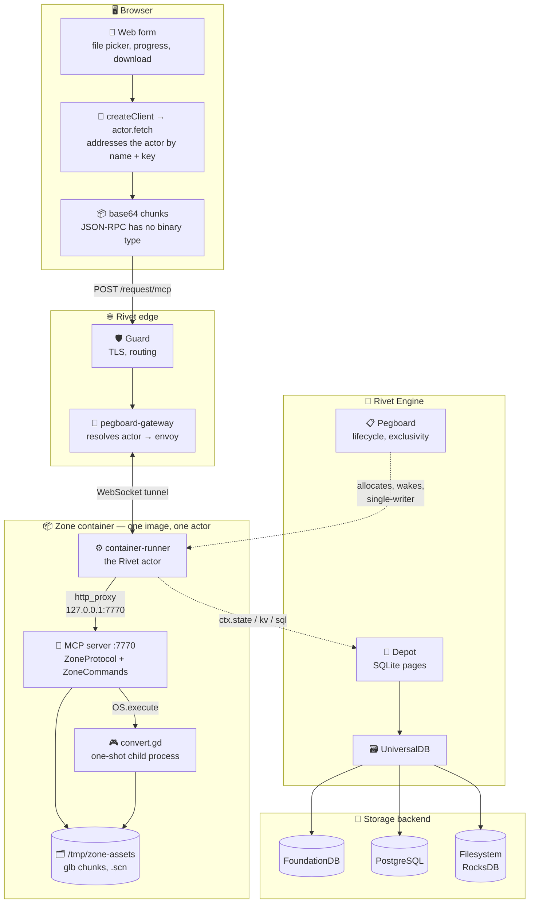
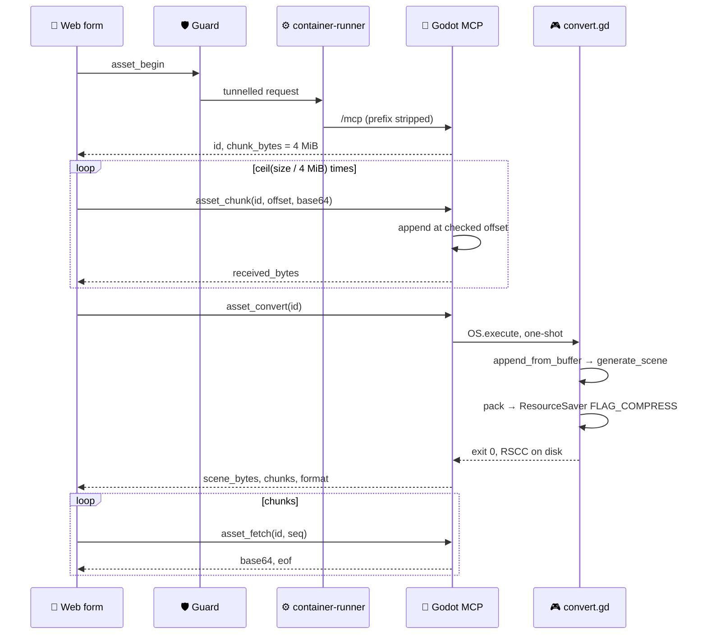

# RFD 0022 — POST a glb, get a Godot scene

## Status

Implemented and measured locally. A 43 MB glb round-trips in 17 seconds and the
zone actor stays under 44 MiB. Not yet run through a live Rivet cluster: the
engine image has never been built ([RFD 0017](0017-engine-bring-up.md)), so the
path below is verified from `container-runner`'s child inward and reasoned about
outward.

## Problem

Convert a 100 MB glb or vrm into a Godot scene, from a client, without adding
storage, a transport, or a second container.

100 MB fits nowhere in one piece. Rivet caps an incoming message at 32 MiB and a
request body at 20 MiB, and MCP is JSON-RPC so binary must be base64, which
inflates by a third. The payload has to be chunked whatever else is decided.

## Decision

Chunk it over MCP, using the surface the zone already exposes. No new route, no
new container, no external storage.

Five tools are added by subclassing the addon rather than patching it, since it
is pinned by commit:

| Tool | Does |
|---|---|
| `asset_begin` | mint an id, return the chunk size |
| `asset_chunk` | append one base64 chunk at a checked offset |
| `asset_status` | bytes received so far, for resuming |
| `asset_convert` | glb to compressed scene, in a child process |
| `asset_fetch` | return one base64 chunk of the result |

## The cluster, end to end



Solid edges carry the payload. Dotted edges are control and state, which the
conversion does not use: the bytes never enter actor storage, because the file
is transient and the zone is the only reader.

## The request path



## The client is a web form

`container-runner/examples/godot-demo/web`, following
`examples/raw-fetch-handler`: a Vite and React page with a file picker, a
progress bar, and a download link.

It uses the sample's client pattern rather than hand-built requests:

```ts
const client = createClient(ENGINE);
const actor = client[ACTOR_NAME].getOrCreate([zoneKey]);
await actor.fetch("/mcp", { method: "POST", body: … });
```

so the page never constructs a URL or sets `x-rivet-actor` itself.

### Why the form does not simply POST the file

A plain `multipart/form-data` submit is the normal way a web form uploads, and
it would avoid base64 entirely. It is not available here for two reasons, one
hard and one chosen:

- **A 100 MB body exceeds the 20 MiB request limit**, so a single form POST
  cannot carry the file whatever encoding is used. Chunking is required either
  way.
- **Everything goes through MCP**, which is JSON-RPC, and JSON has no binary
  type. Chunks are therefore base64, costing a third in transfer.

The alternative is raw binary chunks on a second route, keeping MCP for control
only. That saves the 33% and costs a second surface to build and secure. It was
considered and set aside in favour of one surface.

## Why each choice

**4 MiB chunks.** Base64 makes that ~5.33 MiB, comfortably inside the 20 MiB
request body limit. A 100 MB glb is 25 calls, not 400.

**Checked offsets.** `asset_chunk` takes the offset it believes it is writing at
and refuses a mismatch. A duplicate or reordered delivery is rejected instead of
silently corrupting the file, and `asset_status` makes a resume exact rather
than hopeful.

**Conversion in a child process.** A 100 MB import holds the source buffer, the
generated scene, and the packed output at once. In-process, the long-lived actor
would keep that high-water mark for the rest of its life. Measured: the zone
stayed at **43.8 MiB** while converting a 43 MB glb.

**`ResourceSaver.FLAG_COMPRESS`, not hand-rolled zstd.** It writes Godot's own
`RSCC` container, which `ResourceLoader.load` reads directly with no size passed
alongside and no separate decompress step. Compressing the packed bytes by hand
gives roughly 3x better ratio, because RSCC compresses in blocks to stay
seekable, but then the client must carry the uncompressed size out of band,
decompress before loading, and hold both copies. For a 100 MB asset that peak
costs more than the transfer saves.

**Subclassing, not patching.** `zone_commands.gd extends MCPCommands` and
`zone_protocol.gd` extends the addon's protocol, so the five tools appear in
`tools/list` alongside the addon's 65 and the pinned commit stays untouched.

## Measured

Against `godot-zone-mcp` locally, Godot 4.7.1:

| Input | Chunks up | Scene out | Chunks down | Wall | Zone memory |
|---|---|---|---|---|---|
| 35 KB, 200 meshes | 1 | 28 KB `RSCC` | 1 | <1s | — |
| 43 MB, 60 distinct meshes | 11 | 30.9 MB `RSCC` | 8 | 17s | 43.8 MiB |

Both round trips were verified by loading the returned bytes:
`{"event":"loaded","mesh_instances":200,"root":"TestRoot"}`. That check matters
because `generate_scene` does not set node `owner`, and without the `_claim`
walk in `convert.gd` the packed scene is a **single empty root** — a valid file
containing nothing.

## Not verified

- **Never run through a live cluster.** Guard, pegboard-gateway and the tunnel
  are drawn from their code and from an earlier deployment where MCP through the
  gateway did work, not from a run of this path.
- **100 MB itself.** 43 MB is measured; the remainder is extrapolation. Time
  looks linear, memory should stay flat because conversion is a child.
- **vrm specifically.** vrm is glTF plus humanoid and spring-bone extensions.
  `GLTFDocument` will read the glTF; whether the extensions survive into the
  Godot scene is untested and depends on the addon set in the runtime.
- **The fork's double-precision runtime.** Testing used the upstream Godot in
  `godot-zone-test`. See [RFD 0011](0011-godot-runtime-provenance.md): precision
  is a compile-time property and mixing it desynchronises rather than failing.

## Open questions

- [ ] Does a vrm keep its humanoid rig and spring bones through this path?
- [ ] Should converted output be cached by content hash, so the same glb is not
      converted twice?
- [ ] What cleans up `/tmp/zone-assets` when a conversion is abandoned?
- [ ] Does this belong on the zone at all, or on a dedicated converter actor
      that does not also serve players?
