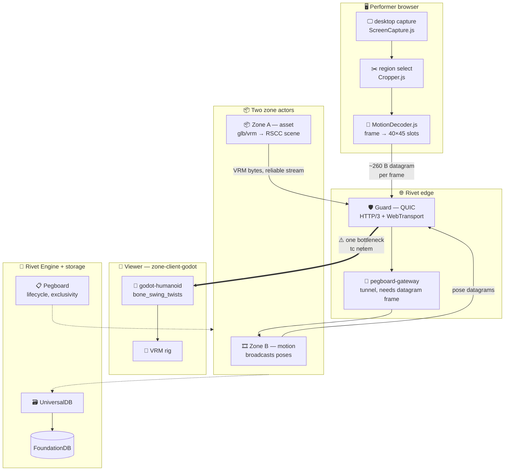
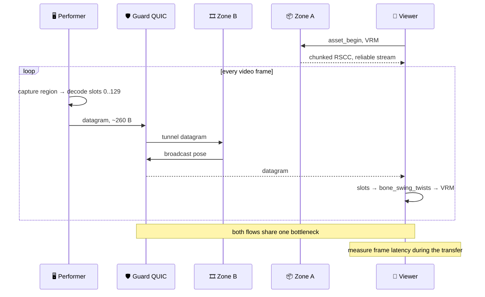

# RFD 0024 — Stream ShaderMotion to a VRM, and prove WebTransport doing it

## Status

Proposed. The transport is proven; the demo is not built.

Steps 1 through 6 of [RFD 0007](0007-webtransport-in-guard.md) are done, and
both channel types are proven end to end against the release engine image. A
real browser, driven by the Playwright MCP, opened a WebTransport session and
got a reply on a reliable stream and on an unreliable datagram. 19 tests pass in
`rivet-guard-core`.

The channel model settled as small as the requirement: **many reliable, one
unreliable, no wire framing**. A reliable channel is one bidirectional stream,
which QUIC keeps ordered and free of head-of-line blocking against the others. A
stream carries only the `u16` length plus path routing header, and
`rivet_unreliable=1` in that path tells Guard to serve the payload as session
datagrams. An interim design with channel identifiers, sequence numbers, and RTP
over QUIC framing was reverted, because nothing needed several unreliable
channels.

What remains is the demo, not the transport under it:

1. **The performer and viewer pages, and zone-side motion streaming.** The web
   client's `transport.ts` already exposes `reliable(path)` and
   `unreliable(path)`, and the GDScript decoder matches the JavaScript reference
   on all 40 `decode_video_float` cases. Nothing streams frames yet, and the
   zone does not push datagrams back through the tunnel.
2. **The measurement.** Two flows on one link shaped locally with `tc netem`,
   once over each transport.

A certificate is **not** a blocker to any of this. Locally a self-signed
certificate accepted through Chromium's `--ignore-certificate-errors-spki-list`
flag connects a real browser with no certificate authority. ACME
([RFD 0026](0026-terminate-tls-for-quic.md)) and the Fly UDP path, whose
dedicated IPv4 is already allocated, are only for a *deployed* demo that others
open without a launch flag.

Modelled on [RFD 0022](0022-glb-to-godot-scene.md), which keeps the asset
conversion path and no longer describes a demo.

## Problem

[RFD 0007](0007-webtransport-in-guard.md) chose WebTransport, and the
demonstration built for it ended up speaking WebSocket. Two commits took it
there, `d279c34b7` and `1ae56caa3`, because with routing unwired there was no
WebTransport path to demonstrate against.

That leaves the transport unjustified, and the obvious fix is worthless. Running
the existing MCP surface over a WebTransport stream proves nothing, because **a
WebTransport bidirectional stream is reliable and ordered, exactly like a
WebSocket**. Moving MCP onto one is a port, not evidence.

The demo has to do something WebSocket cannot do, or the transport work is
unmotivated.

### Independent streams alone do not clear that bar

The usual pitch is a bulk transfer on one stream and control traffic on another,
with no head-of-line blocking between them. A client can open two WebSockets,
get two TCP connections, and have the same isolation. Cheaper is not impossible.

That objection holds only while the two flows are considered separately. Put
them on one bottleneck and it fails, which is the design below.

### Unreliable datagrams do

WebSocket has no unreliable mode. Not a flag, not an option, not a workaround,
because it is defined over a reliable ordered byte stream.

At a 15.6 ms tick a pose that arrives late is worse than useless, because a
newer one has already superseded it. TCP cannot know that. It retransmits the
stale pose and holds every fresher pose behind it until the retransmission
lands, so loss becomes latency for the whole stream and the avatar stalls
instead of degrading. Discarding late data is the feature.

## Decision

One viewer, two actors, one deliberately constrained downlink.

- **Zone A**, the asset zone, converts and streams a 100 MB VRM. This is the path
  [RFD 0022](0022-glb-to-godot-scene.md) documents, measured at 43 MB in 17 s.
- **Zone B**, the motion zone, receives ShaderMotion poses from a performer and
  broadcasts them.

The viewer receives both at once: it is downloading the avatar's model while
already receiving that avatar's motion. If the motion stutters until the model
lands, the experience is broken, and this is the ordinary case in social VR
rather than an edge case.

The contention is therefore at one client's downlink, with two actors behind it.
That is what makes the comparison fair: the same link, the same two flows,
changing only the transport.

## The cluster, end to end

The thick edge is the whole experiment. Both flows cross it, so whichever
transport carries them decides whether the bulk transfer can starve the motion.

## The frame path

## The client is a web page

Modelled on `container-runner/examples/godot-demo/web`, which
[RFD 0022](0022-glb-to-godot-scene.md) added following
`examples/raw-fetch-handler`. Two pages rather than one:

**Performer.** A source picker offering a recorded ShaderMotion video or a
desktop stream, the crop rectangle from `Cropper.js`, and a running frame
counter. It decodes locally and sends slots, not pixels.

**Viewer.** The VRM, a download progress bar for it, and a live latency readout
next to the 15.6 ms tick so the effect is visible rather than only plotted.

### Recorded video for the measurement, desktop stream for the demo

Both are worth having and they are not interchangeable.

A **recorded ShaderMotion video** is what the benchmark uses. Comparing
WebSocket against WebTransport requires identical motion in both runs, and a
recording replays byte for byte. A live source does not, so any latency
difference it showed would be confounded by the motion itself differing between
runs.

A **desktop stream** is the better thing to show a person, because the latency
is felt rather than plotted. It needs no motion capture and no pose estimator:
the screen is already displaying an encoded ShaderMotion texture, so capturing a
region of it captures motion data directly. `ScreenCapture.js` handles screen
geometry and `Cropper.js` the region selection, both already written.

Measure with the recording. Demo with the desktop stream.

## Why each choice

**ShaderMotion as the payload.** Per
`shader_motion_specification/frame_layout.md`, each frame is a **40×45 matrix of
real numbers between ±1**, and a humanoid occupies the first three columns, slots
0 through 129. Most slots hold swing-twist angles in XYZ, scaled from
[-180°, +180°] to [-1, +1]. **Every frame is a complete pose with no dependency
on the frame before it.** Nothing is a delta, so nothing is corrupted by a gap.

**Decode on the client, send slots.** 130 slots at 16 bits is roughly 260 bytes,
comfortably inside one QUIC datagram. That buys the property the whole
experiment rests on: no fragmentation, so a loss costs exactly one pose rather
than a partial frame that cannot be decoded at all. Sending video frames instead
would fragment, and a single lost fragment would discard the whole frame.

**A gap is self-healing.** The next frame is a full replacement, so a drop costs
one skipped pose and the avatar keeps moving. Over WebSocket the same loss is
retransmitted and every fresher pose queues behind a pose that is already
obsolete. The avatar stutters where it should have skipped.

**`godot-humanoid` as the rig.** It is GDScript and exposes `bone_swing_twists`
and `muscle_settings` in `humanoid_pose_calculator.gd`, which is **the same
swing-twist representation the ShaderMotion frame layout emits**. The two share
an author, lox9973, so they were built to meet, and a decoded slot matrix drives
the humanoid without an intermediate format.

**One session, not two.** A WebTransport session is established by a single
CONNECT to a single URL, and `RequestContext` routes on hostname plus path.
Streams inside a session carry no path, so one session resolves to one actor
unless the first bytes of each stream name their target. That demultiplexing
does not exist yet, and it is the mechanism rather than optional framing: two
sessions would restore two congestion controllers and hand back the advantage
being measured.

**Two WebSockets do not rescue the baseline.** Two TCP connections are
independent at the transport layer and not independent on the wire. They share
the bottleneck queue, and every motion frame waits behind bulk bytes TCP has no
reason to treat as less urgent. The stall moves out of the transport into the
network path, where opening more connections cannot reach it. TCP offers no way
to say "this connection yields to that one", because priority across independent
connections is not something the kernel or the network can express. One QUIC
connection can: two streams, one congestion controller, and a sender that knows
motion outranks bulk.

## Prior art and licensing

| Piece | Where | License |
|---|---|---|
| Upstream ShaderMotion | `gitlab.com/lox9973/ShaderMotion`, since 2020 | MIT |
| Format specification | `shader-motion-navy-lead-ostrich/shader_motion_specification` | MIT, lox9973 |
| Reference decoder, JS | `MotionDecoder.js`, `HumanPoser.js` | MIT |
| Capture and crop, JS | `ScreenCapture.js`, `Cropper.js` | MIT |
| Original, C# | `blender-shader-motion` | MIT |
| Godot humanoid rig | `godot-humanoid` | Apache-2.0 |

Both licenses permit the port with attribution. These are `V-Sekai` and
`lox9973` repos rather than `v-sekai-multiplayer-fabric`, so upstream stays
read-only and anything written lands in the fabric org.

## The claim, stated so it can fail

On a shared bottleneck, WebTransport holds the viewer's frame-latency p99 near
the 15.6 ms tick while the VRM transfer saturates the link, and two WebSockets
cannot, at any connection count.

Cap the bottleneck with `tc netem` so Zone A's transfer saturates it, and add 2%
loss with 50 ms RTT, an ordinary mobile network rather than a pathological one.
`container-runner/examples/e2e-test/load-test.mjs` already reports `p50`, `p95`,
`p99`, and `max`.

| | WebSocket, two connections | WebTransport, one session |
|---|---|---|
| Zone A VRM transfer | saturates bottleneck | saturates bottleneck |
| Viewer p99 during transfer | expected to climb with queue depth | expected flat near tick |
| Cross-flow priority | not expressible | stream priority, or datagrams |
| One lost frame | stutter, stale pose retransmitted | skip, next frame is a full pose |

If p99 stays flat on both, this RFD has disproved its own premise. That is worth
knowing, because [RFD 0007](0007-webtransport-in-guard.md) chose the transport
on this reasoning, and the tunnel work is only justified if the gap is real.

## Measured

Nothing. This RFD proposes an experiment and reports no results.

The only figures it leans on come from
[RFD 0022](0022-glb-to-godot-scene.md): 43 MB converted in 17 s with the zone at
43.8 MiB, which is the load Zone A generates.

## Not verified

- **The 260-byte frame size** is computed from the slot count in the
  specification at an assumed 16 bits per slot, not observed on the wire.
- **The 15.6 ms tick surviving the internal path.**
  [RFD 0007](0007-webtransport-in-guard.md) estimates 1 to 3 ms for four broker
  crossings and that estimate has never been measured. If it is wrong, the
  external transport is not the bottleneck and this experiment measures the
  wrong leg.
- **That `godot-humanoid` accepts ShaderMotion slots directly.** The
  representations match on inspection and share an author. No one has fed one
  into the other.

## What blocks it

Not the tunnel, as it turns out, and not the protocol.

The experiment's bottleneck is the viewer's downlink between client and Guard.
That is the only impaired link. The tunnel hop is inside the datacenter, and
[RFD 0007](0007-webtransport-in-guard.md) estimates it at 1 to 3 ms, so
unreliability is only needed on the client leg.

`WebSocketHandle` is already erased over its transport, so a datagram-backed
`Stream` and `Sink` satisfy it and **nothing downstream needs to know**. No
protocol version, no gateway change, no `container-runner` change, and the zone
receives ordinary frames without learning which transport carried them.

An earlier attempt added a datagram kind to **runner-protocol** v8 and was
reverted. That protocol does not reach a container actor: `container-runner`
depends on `rivetkit`, which reaches `envoy-client`, which speaks
envoy-protocol, and guard routing returns `PegboardGateway2`. runner-protocol
is the deprecated stack. Recording this so nobody repeats it.

### TLS is the real blocker on Fly, now its own RFD

The analysis below stands, and the decisions it led to are recorded in
[RFD 0026](0026-terminate-tls-for-quic.md): a real Let's Encrypt certificate
rather than `serverCertificateHashes`, stored in UniversalDB because the engine
app has no volume and Let's Encrypt allows five duplicate certificates a week.

The resolver and the QUIC bind address are done; issuance is not.

#### The original finding

Guard binds the QUIC listener only when an HTTPS address and a certificate
resolver both exist. `guard/src/lib.rs:36` logs "No TLS configuration found,
HTTPS will not be enabled" otherwise.

Fly terminates TLS at its edge and forwards plain HTTP to the app, so
`guard.https` is unset and the listener never binds. QUIC cannot work this way
even in principle: Fly's UDP forwarding passes raw packets, so the handshake has
to terminate inside the container.

Running the experiment on Fly therefore needs, beyond the dedicated IPv4 from
[RFD 0025](0025-host-on-fly.md):

- Certificates inside the container, populating `guard.https.tls`, which is four
  paths: `actor_cert_path`, `actor_key_path`, `api_cert_path`, `api_key_path`.
- A UDP service on the same port as HTTPS.
- A client that accepts the certificate. A short-lived self-signed certificate
  plus WebTransport's `serverCertificateHashes` avoids provisioning a real one,
  and browsers accept that path.

**This is an argument for measuring locally first.** `tc netem` shapes a local
link precisely and costs nothing, and the impairment is the whole point of the
experiment. The Fly run adds real-network realism, which matters for
[RFD 0007](0007-webtransport-in-guard.md) step 8, but it is not where this
should start.

## Deferred

**Datagrams for the VRM transfer.** Bulk transfer wants reliability and
ordering, and a reliable stream is the right carrier. Nothing here argues
otherwise.

**Many performers in one zone.** The demo is one performer and one viewer.
Broadcast fan-out is a separate question about zone capacity, not about
transport, and adding it would confound the measurement.

**Native client.** The viewer is `zone-client-godot` as a web build, because
that is what makes WebTransport necessary rather than optional. A native client
could use raw QUIC and would not exercise the same path.

## Consequences

A droppable tunnel path is the foundation for pose replication generally, not
only for this demonstration, which is the argument for paying for it once here.

It also puts a load-bearing dependency on an upstream format. ShaderMotion is
MIT and specified in-repo, so the risk is bounded, but the fabric org takes on a
port it has to maintain.

If the measurement comes out flat, the honest outcome is to keep WebSocket and
close [RFD 0007](0007-webtransport-in-guard.md) unimplemented.

## Open questions

- [ ] What bottleneck bandwidth makes the contention realistic rather than
      staged? Too tight and WebSocket fails trivially, too loose and neither
      transport is stressed.
- [ ] Datagrams only, or datagrams plus a reliable pose on join? A viewer
      arriving mid-stream has no pose until the next frame, which is roughly
      16 ms and probably fine, but it is unverified.
- [ ] Where does the decoder live so both the zone and a future native client
      can use it, given the reference is JavaScript and the rig is GDScript?
- [ ] Does the fork's double-precision runtime change any of the swing-twist
      maths? See [RFD 0011](0011-godot-runtime-provenance.md).
